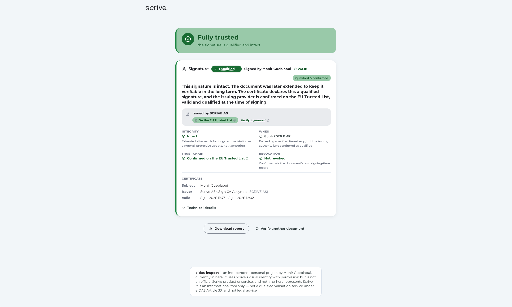

# eidas-inspect

A hosted service that verifies digital signatures, seals, and timestamps in PDFs against the eIDAS framework — and explains the result in plain language.

**Live:** [eidas-inspect-production.up.railway.app](https://eidas-inspect-production.up.railway.app/)

<!--
  PLACEHOLDER — hero screenshot.
  Drop in: docs/images/hero.png
  Capture: the result view for a document that resolves to "Fully trusted"
  (a qualified, confirmed signature or seal) — the verdict banner plus at
  least one signature card, showing the plain-language lead sentence and
  the field grid. Full browser width isn't necessary; a mobile-width crop
  (~420px) matches the project's actual design intent (mobile-first) and
  looks better in a README than a wide desktop screenshot.
-->


## Why

Existing validators are either impenetrable (the EU's own DSS tool dumps a wall of ASN.1 and certificate chains on you) or an unexplained checkmark (Adobe just tells you it's "signed" and moves on). Neither helps someone who actually needs to know whether a document can be trusted.

eidas-inspect's bet is radical legibility: an opinionated traffic-light verdict a non-expert can act on immediately, backed by expandable technical detail for anyone who wants to see the actual chain of reasoning.

## Status

Built with [Claude Code](https://claude.com/claude-code) over ~3 days, in public.

**Done**
- Core validation engine (`core/`, pyHanko-based): signature, seal, and timestamp discovery; integrity and tamper detection, with PAdES-LTA awareness so legitimate long-term-archival extensions aren't misreported as tampering
- Point-in-time validation: certificate validity and revocation are checked as of the actual signing moment (backed by a verified timestamp), not "now" — the mechanism that keeps a short-lived QES certificate checkable long after it expires
- EU Trusted List matching: qualified-service lookup against every member state's published list, with territory attribution and a "Verify it yourself" deep link to the EU's own eIDAS Dashboard
- Revocation checking: live OCSP/CRL, and the document's own embedded revocation record (DSS) when a live check isn't possible or needed
- qcStatements classification per ETSI EN 319 412-5 — conservative by design, never over-claiming "Qualified" on an ambiguous certificate
- KSI (Guardtime Keyless Signature Infrastructure) seal support: detection of the non-standard `/FT /KSI` embedding, plus real cryptographic verification across three tiers (internal consistency, key-based, publication-based) via Guardtime's own `ksi-tool`
- FastAPI backend, strictly ephemeral (documents processed in memory only, never written to disk, never logged)
- React (Vite) frontend, mobile-first, with plain-language verdict cards and expandable technical detail
- PDF report export
- Live deployment (Railway, one Dockerfile, health-checked, auto-deploys on push)

<!--
  PLACEHOLDER — demo GIF.
  Drop in: docs/images/demo.gif
  Capture: the actual upload flow end to end — drag a PDF onto the upload
  zone (or tap to pick one), the brief "verifying" animation, then the
  result view resolving in. ~10-15 seconds, looping, no audio. A qualified/
  trusted document works best here — it's the flow most first-time visitors
  will want to see work.
-->


## Architecture

- **`core/`** — pure Python validation package (`eidas_inspect_core`), zero web dependencies. pyHanko handles PAdES/CMS cryptography; this package adds qcStatements parsing, EU Trusted List matching, KSI seal handling, and plain-language verdict mapping on top.
- **`api/`** — a FastAPI wrapper around `core`. Strictly ephemeral: uploaded files are processed in memory only, never written to disk, never logged. Passwords for encrypted PDFs are never stored.
- **`web/`** — a React (Vite) frontend, mobile-first responsive.
- One root `Dockerfile` builds all three into a single image for deployment.

## Local development

```bash
python3.12 -m venv .venv
source .venv/bin/activate
pip install -e core/ -r api/requirements-dev.txt
pytest core/tests api/tests

uvicorn api.main:app --reload      # API on :8000

cd web && npm install && npm run dev   # frontend on :5173, proxies /api to :8000
```

KSI seal verification additionally needs Guardtime's [`ksi-tool`](https://github.com/guardtime/ksi-tool) CLI installed and on `PATH` (see the Dockerfile for the exact pinned Debian package versions used in production); without it, KSI seals are still detected but reported as unverified rather than erroring.

## Known limitations

- This is an informational tool, not a qualified validation service under eIDAS Article 33, and nothing it says is legal advice. It's a personal project — use your own judgment for anything that matters.
- KSI's `PUBLICATION_VERIFIED` tier (the strongest one — anchored to a publicly witnessed record) can't currently reach a conclusive result: Guardtime's live publications file is itself signed by a certificate chaining through a specialized GlobalSign root that isn't in this environment's CA trust store. This is an external trust-chain gap, not a bug in this project's own verification logic — see `PROGRESS.md` for the full root-cause writeup.
- Territory attribution for a signer's issuing authority relies on matching against the EU Trusted List's own service records; a `Subject C=` (country) field on the certificate itself isn't used as a fallback heuristic yet, so attribution can occasionally be less precise than it could be.

## Privacy

Uploaded documents are never written to disk or logged. Ever.

## Dependencies

Besides the usual Python/JS package ecosystem (see `core/pyproject.toml`, `api/requirements.txt`, `web/package.json`):

- [**pyHanko**](https://github.com/MatthiasValvekens/pyHanko) (MIT) — PAdES/CMS signature and timestamp validation. This project never reimplements that cryptography; it wraps pyHanko and adds the eIDAS-specific layer on top (qcStatements, Trusted List matching, verdict mapping).
- [**ksi-tool**](https://github.com/guardtime/ksi-tool) (Apache-2.0) — Guardtime's own reference implementation for verifying KSI seals, installed in the production image and subprocessed out to, for the same reason: never reimplement a trust engine's own cryptography.

## License

MIT — see [LICENSE](LICENSE).
